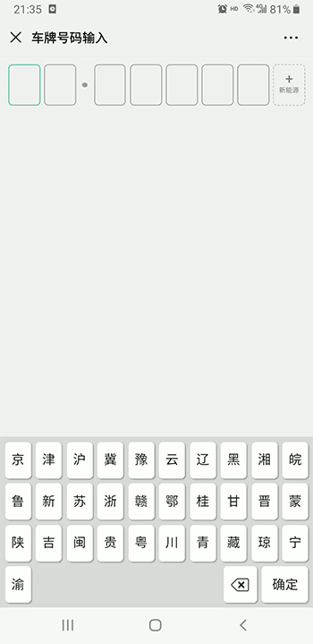

# vue-keyboard vue 虚拟键盘 车牌号码输入


## 效果图


 
## API

| 名称        | 类型    | 默认值       | 描述  |                 
| ----------- | ------- | ----------| 

| plateNumber    | Array  | false   | 当前车牌号码    |


## Event

| 事件名   | 说明             | 返回值                 |
| -------- | ---------------- | --------------------- |
| change | 值发生变动时触发 | 当前plateNumber 值 |

 
-   安装

```bash
npm i vue-keyboard --save
```

-   使用

```html
<template>
  <div class="page page-index">
   <keyboard :plateNumber.sync="plateNumber" @change="change"></keyboard>
 </div>
</template>
<script>
    import keyboard from "@/components/keyboard/index";
    export default {
        name: "keyboardDemo",
        mounted: function() {},
        components: {
            keyboard
        },
        data() {
            return {
                plateNumber: '粤A12345'.split('')
            };
        },
        watch: {
            plateNumber(v){
                console.log(v)
            }
        },
        created() {
        },
        methods: {
           change(v){
             console.log('当前车牌号码：'+v.join(''));
           }

        }
    };
</script>

<style lang="scss">
   .page{
       padding:20px;
   }
</style>
```
